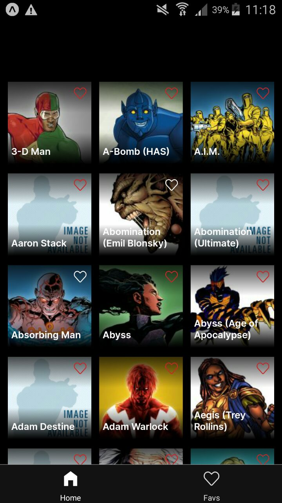

# Marvel API App
## Table of contents
- [Motivation](#motivation)
- [Description](#description)
- [The Stack](#the-stack)
- [How to test locally](#how-to-test-locally)
- [Marvel API requests](#marvel-api)
    - [Sensitive info](#sensitive-info)
- [App state](#app-state)
- [Design](#design)
    - [Skipped](#skipped)
    - [Added](#added)
    - [Ideas](#ideas)
- [Devices](#devices)
    - [Samsung A21](#samsung-a21)
    - [Samsung Galaxy S5](#samsung-galaxy-s5)
    - [Aquaris M10](#aquaris-m10)
- [TODO](#todo)
- [Time and learning](#time-and-learning)

## Motivation
This project is the [JimenaAndrea](https://github.com/JimenaAndrea) solution for the react native's technical test for Secture company.

## Description
This is a simple application that has two main screens that you can access from the tab bar. On the main page you can see 30 marvel characters and mark them as favorites. And on the favorites page you can see the ones you have previously marked. You can also click on each character to access their information.

"Data provided by Marvel. © 2014 Marvel" [Marvel API](https://developer.marvel.com/)

## The Stack
This app has been developed in **[React Native](https://github.com/facebook/react-native)** over **[Expo](https://github.com/expo/expo)**. Also uses:
* **[Redux](https://github.com/reduxjs/redux)** and **[Redux Toolkit](https://github.com/reduxjs/redux-toolkit)** to keep favourites state.
* **[redux-persist](https://github.com/rt2zz/redux-persist)** as the persist method.
* **[React Navigation](https://github.com/react-navigation/react-navigation)** as the navigation method.
* **[axios](https://github.com/axios/axios)** to make requests to the Marvel API.
* **[React Query](https://github.com/tannerlinsley/react-query)** to manage requests' state and cache results.
* **[md5](https://github.com/pvorb/node-md5)** to generate the md5 hash needed to make requests to the API.
* **[react-native-async-storage](https://github.com/react-native-async-storage/async-storage)** as the data storage system.
* **[react-native-vector-icons](https://github.com/oblador/react-native-vector-icons)** for the icons in the app.
* **[react-native-material-ripple](https://github.com/n4kz/react-native-material-ripple)** to animate pressable components.
* **[react-native-super-grid](https://github.com/saleel/react-native-super-grid)** for the grid layouts.
* **[expo-status-bar](https://github.com/expo/expo/tree/main/packages/expo-status-bar)** to style the status bar.
* **[expo-google-fonts](https://github.com/expo/google-fonts)** to use google fonts in the app.
* **[expo-linear-gradient](https://github.com/expo/expo/tree/main/packages/expo-linear-gradient)** for the gradients in the images.
* **[expo-navigation-bar](https://github.com/expo/expo/tree/main/packages/expo-navigation-bar)** to style the navigation bar.

## How to test locally
You'll need yarn and expo-client installed. After that, clone this repository and **add your keys of the Marvel API to the *config* file**, and run:

```
yarn install

yarn start
```

Then the expo developer tools will be available. To run the app in a device you need to install Expo Go app.

## Marvel API requests
To make the API requests I have used axios together with React Query. React Query caches the request results, helping us limiting the number of requests made to the API. To do this we can set a timeout between requests of the same type, showing until then the previous cached data.

### Sensitive info
To access the Marvel API it is necessary to provide some parameters for authentication. In the case of this application we need to pass the public key, a timestamp and the result of passing the timestamp parameter, the private key and the public key through a hash function.

The personal keys have to be in the app code to make the requests. The public and private keys are stored in the *config* file and, to avoid security issues, the code is commited without a real value assigned. 

**If you want to test the application you have to enter your keys in the *config* file.**


## App state
In this application the only data we need to save are the characters that have been marked as favorites. For this I have decided to use Redux together with Redux toolkit to manage the application's state.

Using only these technologies, when you close the application, all saved data is lost. To avoid this I use redux persist.

## Design
I have developed the application according to the figma designs that were given to me with the briefing. But in some cases I do it different or I added some details.

### Skipped
- **Tab bar navigation items layout.** In the design the items of the tab bar navigation have more space between them.

### Added
- **Animations in floating action button and back button in character detail screen.**
- **Placeholder text in the detail screen of the characters that don't have description.** Some characters have no description and those that do are very short, so I added a placeholder to show how the screen scroll works.
- **Black splash screen.**
- **Navigation bar dark color.** Most smartphones now have the navigation keys integrated into the screen. To avoid that in this application it comes out white and has a lot of contrast with the interface, I have put it in the same color as the tab navigator.
- **Black footer in home screen and favourites screen.** To visually reinforce the end of the scroll.
- **Activity indicator while data is being loaded.**

### Ideas
- **Resizeable character card.** Right now, the character card component receives as props the values of the sizes of the font and fav item. The component could rescale the sizes of your items automatically.
- **Solid icon for favourites screen in tab bar navigation.** I think having both icons in the same style makes the design more consistent. It also helps differentiate which icon is focused.
- **Filter characters to have 30 with image and description.** I request the 30 first characters in the Marvel API and some of them don't have image or description.

## Devices
### Samsung A21
**Home Screen**


**Character Screen**


**Favourites Screen**


### Samsung Galaxy S5
**Home Screen**



**Character Screen**


**Favourites Screen**


### Aquaris M10
**Home Screen**


**Character Screen**


**Favourites Screen**


## TODO
- I have tested the code in two different android smartphones and in an android tablet. It remains to be tested in an iOS device.

- Remaining to be done a build of the app to get the apk and check that everything is working properly.

- Custom splash screen and app icon for the apk.

## Time and learning
It has taken me about 35 hours of work to complete this exercise, but it has not all been development. I had to find out what technology to use to make the API requests and learn how to use it since it was the first time I worked with it.
